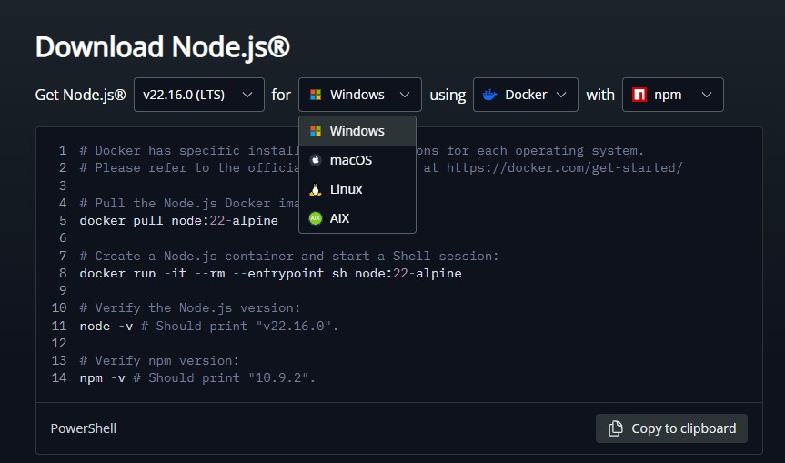
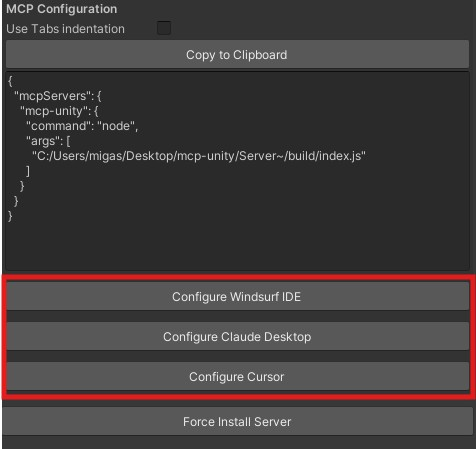
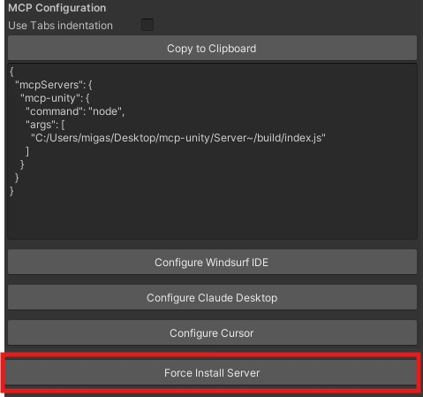

# MCP Unity Editor（游戏引擎）

[](https://modelcontextprotocol.io/introduction)
[](https://unity.com/releases/editor/archive)
[](https://nodejs.org/en/download/)
[](https://github.com/CoderGamester/mcp-unity/stargazers)
[](https://github.com/CoderGamester/mcp-unity/commits/main)
[](https://opensource.org/licenses/MIT)

| [英文](README.md) | [🇨🇳简体中文](README_zh-CN.md) | [🇯🇵日本語](README-ja.md) |
|----------------------|---------------------------------|----------------------|


```                                                                        
                              ,/(/.   *(/,                                  
                          */(((((/.   *((((((*.                             
                     .*((((((((((/.   *((((((((((/.                         
                 ./((((((((((((((/    *((((((((((((((/,                     
             ,/(((((((((((((/*.           */(((((((((((((/*.                
            ,%%#((/((((((*                    ,/(((((/(#&@@(                
            ,%%##%%##((((((/*.             ,/((((/(#&@@@@@@(                
            ,%%######%%##((/(((/*.    .*/(((//(%@@@@@@@@@@@(                
            ,%%####%#(%%#%%##((/((((((((//#&@@@@@@&@@@@@@@@(                
            ,%%####%(    /#%#%%%##(//(#@@@@@@@%,   #@@@@@@@(                
            ,%%####%(        *#%###%@@@@@@(        #@@@@@@@(                
            ,%%####%(           #%#%@@@@,          #@@@@@@@(                
            ,%%##%%%(           #%#%@@@@,          #@@@@@@@(                
            ,%%%#*              #%#%@@@@,             *%@@@(                
            .,      ,/##*.      #%#%@@@@,     ./&@#*      *`                
                ,/#%#####%%#/,  #%#%@@@@, ,/&@@@@@@@@@&\.                    
                 `*#########%%%%###%@@@@@@@@@@@@@@@@@@&*´                   
                    `*%%###########%@@@@@@@@@@@@@@&*´                        
                        `*%%%######%@@@@@@@@@@&*´                            
                            `*#%%##%@@@@@&*´                                 
                               `*%#%@&*´                                     
                                                        
     ███╗   ███╗ ██████╗██████╗         ██╗   ██╗███╗   ██╗██╗████████╗██╗   ██╗
     ████╗ ████║██╔════╝██╔══██╗        ██║   ██║████╗  ██║██║╚══██╔══╝╚██╗ ██╔╝
     ██╔████╔██║██║     ██████╔╝        ██║   ██║██╔██╗ ██║██║   ██║    ╚████╔╝ 
     ██║╚██╔╝██║██║     ██╔═══╝         ██║   ██║██║╚██╗██║██║   ██║     ╚██╔╝  
     ██║ ╚═╝ ██║╚██████╗██║             ╚██████╔╝██║ ╚████║██║   ██║      ██║   
     ╚═╝     ╚═╝ ╚═════╝╚═╝              ╚═════╝ ╚═╝  ╚═══╝╚═╝   ╚═╝      ╚═╝   
```       

MCP Unity 是 Model Context Protocol 在 Unity 编辑器中的实现，允许 AI 助手与您的 Unity 项目交互。这个包提供了 Unity 和实现 MCP 协议的 Node.js 服务器之间的桥梁，使 Claude、Windsurf 和 Cursor 等 AI 代理能够在 Unity 编辑器中执行操作。

<a href="https://glama.ai/mcp/servers/@CoderGamester/mcp-unity">
  
</a>

## 功能

### IDE 集成 - 包缓存访问

MCP Unity 通过将 Unity `Library/PackedCache` 文件夹添加到您的工作区，提供与 VSCode 类 IDE（Visual Studio Code、Cursor、Windsurf）的自动集成。此功能：

- 提高对 Unity 包的代码智能感知
- 为 Unity 包提供更好的自动完成和类型信息
- 帮助 AI 编码助手理解您项目的依赖关系

### MCP 服务器工具

- `execute_menu_item`: 执行 Unity 菜单项（用 MenuItem 属性标记的函数）
  > **示例提示:** "执行菜单项 'GameObject/Create Empty' 创建一个新的空 GameObject"

- `select_gameobject`: 通过路径或实例 ID 选择 Unity 层次结构中的游戏对象
  > **示例提示:** "选择场景中的 Main Camera 对象"

- `update_gameobject`: 更新 GameObject 的核心属性（名称、标签、层、激活/静态状态），如果不存在则创建
  > **示例提示:** "将 Player 对象的标签设置为 ‘Enemy’ 并使其不可用"

- `update_component`: 更新 GameObject 上的组件字段，如果 GameObject 不包含该组件则添加它
  > **示例提示:** "给 Player 对象添加 Rigidbody 组件并设置其质量为 5"

- `add_package`: 在 Unity 包管理器中安装新包
  > **示例提示:** "给我的项目添加 TextMeshPro 包"

- `run_tests`: 使用 Unity 测试运行器运行测试
  > **示例提示:** "运行我项目中所有的 EditMode 测试"

- `send_console_log`: 发送控制台日志到 Unity
  > **示例提示:** "发送控制台日志到 Unity 编辑器"

- `add_asset_to_scene`: 将 AssetDatabase 中的资源添加到 Unity 场景中
  > **示例提示:** "将我的项目中的 Player 预制体添加到当前场景"

- `take_screenshot`: 将游戏视图截图保存到 `Assets/Screenshots`
  > **示例提示:** "截取游戏视图的屏幕截图"

- `create_text_asset`: 在 Unity 项目中创建文本文件
  > **示例提示:** "在 Assets/Docs 下创建 README.txt 文件"

- `get_text_asset`: 读取 Unity 项目中文本文件的内容
  > **示例提示:** "查看 Assets/Docs/README.txt 的内容"


### MCP 服务器资源

- `unity://menu-items`: 获取 Unity 编辑器中所有可用的菜单项列表，以方便 `execute_menu_item` 工具
  > **示例提示:** "显示与 GameObject 创建相关的所有可用菜单项"

- `unity://scenes-hierarchy`: 获取当前 Unity 场景层次结构中所有游戏对象的列表
  > **示例提示:** "显示当前场景层次结构"

- `unity://gameobject/{id}`: 通过实例 ID 或场景层次结构中的对象路径获取特定 GameObject 的详细信息，包括所有 GameObject 组件及其序列化的属性和字段
  > **示例提示:** "获取 Player GameObject 的详细信息"

- `unity://logs`: 获取 Unity 控制台的所有日志列表
  > **示例提示:** "显示 Unity 控制台最近的错误信息"

- `unity://packages`: 从 Unity 包管理器获取已安装和可用包的信息
  > **示例提示:** "列出我 Unity 项目中当前安装的所有包"

- `unity://assets`: 获取 Unity 资产数据库中资产的信息
  > **示例提示:** "查找我项目中的所有纹理资产"

- `unity://tests/{testMode}`: 获取 Unity 测试运行器中测试的信息
  > **示例提示:** "列出我 Unity 项目中所有可用的测试"

## 要求
- Unity 2022.3 或更高版本 - 用于[安装服务器](#install-server)
- Node.js 18 或更高版本 - 用于[启动服务器](#start-server)
- npm 9 或更高版本 - 用于[调试服务器](#debug-server)

## <a name="install-server"></a>安装

> [!IMPORTANT]
> **项目路径不能包含空格**
>
> 您的 Unity 项目文件路径**不能包含任何空格**，这一点至关重要。
> 如果您的项目路径包含空格，MCP 客户端（例如 Cursor、Claude、Windsurf）将无法连接到 MCP Unity 服务器。
>
> **示例：**
> -   ✅ **有效：** `C:\Users\YourUser\Documents\UnityProjects\MyAwesomeGame`
> -   ❌ **无效：：** `C:\Users\Your User\Documents\Unity Projects\My Awesome Game`
>
> 在继续安装之前，请确保您的项目位于不含空格的路径中。

安装 MCP Unity 服务器是一个多步骤过程：

### 步骤 1: 安装 Node.js 
> 要运行 MCP Unity 服务器，您需要在计算机上安装 Node.js 18 或更高版本：



<details>
<summary><span style="font-size: 1.1em; font-weight: bold;">Windows</span></summary>

1. 访问 [Node.js 下载页面](https://nodejs.org/en/download/)
2. 下载 Windows 安装程序 (.msi) 的 LTS 版本（推荐）
3. 运行安装程序并按照安装向导操作
4. 通过打开 PowerShell 并运行以下命令验证安装：
   ```bash
   node --version
   ```
</details>

<details>
<summary><span style="font-size: 1.1em; font-weight: bold;">macOS</span></summary>

1. 访问 [Node.js 下载页面](https://nodejs.org/en/download/)
2. 下载 macOS 安装程序 (.pkg) 的 LTS 版本（推荐）
3. 运行安装程序并按照安装向导操作
4. 或者，如果您已安装 Homebrew，可以运行：
   ```bash
   brew install node@18
   ```
5. 通过打开终端并运行以下命令验证安装：
   ```bash
   node --version
   ```
</details>

### 步骤 2: 通过 Unity 包管理器安装 Unity MCP 服务器包
1. 打开 Unity 包管理器 (Window > Package Manager)
2. 点击左上角的 "+" 按钮
3. 选择 "Add package from git URL..."
4. 输入: `https://github.com/CoderGamester/mcp-unity.git`
5. 点击 "Add"


### 步骤 3: 配置 AI LLM 客户端

<details open>
<summary><span style="font-size: 1.1em; font-weight: bold;">选项 1: 使用 Unity 编辑器配置</span></summary>

1. 打开 Unity 编辑器
2. 导航到 Tools > MCP Unity > Server Window
3. 点击 "Configure" 按钮为您的 AI LLM 客户端配置，如下图所示



4. 使用给定的弹出窗口确认配置安装


</details>

<details>
<summary><span style="font-size: 1.1em; font-weight: bold;">选项 2: 手动配置</span></summary>

打开您的 AI 客户端的 MCP 配置文件（例如 Claude Desktop 中的 claude_desktop_config.json）并复制以下文本：

> 将 `ABSOLUTE/PATH/TO` 替换为您的 MCP Unity 安装的绝对路径，或者直接从 Unity 编辑器 MCP 服务器窗口（Tools > MCP Unity > Server Window）复制文本。

```json
{
  "mcpServers": {
    "mcp-unity": {
      "command": "node",
      "args": [
        "ABSOLUTE/PATH/TO/mcp-unity/Server~/build/index.js"
      ]
    }
  }
}
```

</details>

## <a name="start-server"></a>启动 Unity 编辑器 MCP 服务器
1. 打开 Unity 编辑器
2. 导航到 Tools > MCP Unity > Server Window
3. 点击 "Start Server" 按钮以启动 WebSocket 服务器
4. 打开 Claude Desktop 或您的 AI 编码 IDE（例如 Cursor IDE、Windsurf IDE 等）并开始执行 Unity 工具
   


> 当 AI 客户端连接到 WebSocket 服务器时，它将自动显示在窗口的绿色框中

## 可选：设置 WebSocket 端口
默认情况下，WebSocket 服务器运行在 '8090' 端口。您可以通过两种方式更改此端口：

1. 打开 Unity 编辑器
2. 导航到 Tools > MCP Unity > Server Window
3. 将 "WebSocket Port" 值更改为所需的端口号
4. Unity 将设置系统环境变量 UNITY_PORT 为新的端口号
5. 重启 Node.js 服务器
6. 再次点击 "Start Server" 以重新连接 Unity 编辑器 WebSocket 到 Node.js MCP 服务器

## 可选：设置超时

默认情况下，MCP 服务器与 WebSocket 之间的超时时间为 10 秒。
您可以根据您使用的操作系统进行更改：

1. 打开 Unity 编辑器
2. 导航到 Tools > MCP Unity > Server Window
3. 将 "Request Timeout (seconds)" 值更改为所需的超时秒数
4. Unity 将设置系统环境变量 UNITY_REQUEST_TIMEOUT 为新的超时值
5. 重启 Node.js 服务器
6. 再次点击 "Start Server" 以重新连接 Unity 编辑器 WebSocket 到 Node.js MCP 服务器

> [!TIP]  
> 您的 AI 编码 IDE（例如 Claude Desktop、Cursor IDE、Windsurf IDE）与 MCP 服务器之间的超时时间取决于 IDE。

## 可选：允许远程 MCP Bridge 连接

默认情况下，WebSocket 服务器绑定到 'localhost'。要允许来自其他设备的 MCP Bridge 连接，请执行以下步骤：

1. 打开 Unity 编辑器  
2. 依次点击菜单「Tools > MCP Unity > Server Window」  
3. 勾选"Allow Remote Connections（允许远程连接）"复选框  
4. Unity 将 WebSocket 服务器绑定到 '0.0.0.0'（所有网络接口）  
5. 重新启动 Node.js 服务器以应用新的主机配置  
6. 在远程运行 MCP Bridge 时，将环境变量 UNITY_HOST 设置为 Unity 所在机器的 IP 地址：  
   `UNITY_HOST=192.168.1.100 node server.js`

## <a name="debug-server"></a>调试服务器

<details>
<summary><span style="font-size: 1.1em; font-weight: bold;">构建 Node.js 服务器</span></summary>

MCP Unity 服务器使用 Node.js 构建。它需要将 TypeScript 代码编译到 `build` 目录中。
如果出现问题，您可以通过以下方式强制安装：

1. 打开 Unity 编辑器
2. 导航到 Tools > MCP Unity > Server Window
3. 点击 "Force Install Server" 按钮



如果您想手动构建，可以按照以下步骤操作：

1. 打开终端/PowerShell/命令提示符

2. 导航到 Server 目录：
   ```bash
   cd ABSOLUTE/PATH/TO/mcp-unity/Server~
   ```

3. 安装依赖：
   ```bash
   npm install
   ```

4. 构建服务器：
   ```bash
   npm run build
   ```

5. 运行服务器：
   ```bash
   node build/index.js
   ```

</details>
   
<details>
<summary><span style="font-size: 1.1em; font-weight: bold;">使用 MCP Inspector 调试</span></summary>

使用 [@modelcontextprotocol/inspector](https://github.com/modelcontextprotocol/inspector) 调试服务器：
   - Powershell
   ```powershell
   npx @modelcontextprotocol/inspector node Server~/build/index.js
   ```
   - 命令提示符/终端
   ```cmd
   npx @modelcontextprotocol/inspector node Server~/build/index.js
   ```

在关闭终端或使用 [MCP Inspector](https://github.com/modelcontextprotocol/inspector) 调试之前，请务必使用 `Ctrl + C` 关闭服务器。

</details>

<details>
<summary><span style="font-size: 1.1em; font-weight: bold;">启用控制台日志</span></summary>

1. 启用终端或 log.txt 文件中的日志记录：
   - Powershell
   ```powershell
   $env:LOGGING = "true"
   $env:LOGGING_FILE = "true"
   ```
   - 命令提示符/终端
   ```cmd
   set LOGGING=true
   set LOGGING_FILE=true
   ```

</details>

## 常见问题

<details>
<summary><span style="font-size: 1.1em; font-weight: bold;">什么是 MCP Unity？</span></summary>

MCP Unity 是一个功能强大的桥梁，使用 Model Context Protocol (MCP) 将您的 Unity 编辑器环境连接到 AI 助手 LLM 工具。

本质上，MCP Unity：
-   将 Unity 编辑器功能（如创建对象、修改组件、运行测试等）公开为 AI 可以理解和使用的“工具”和“资源”。
-   在 Unity 内部运行 WebSocket 服务器，并在 Node.js 服务器（作为 Unity 的 WebSocket 客户端）中实现 MCP。这允许 AI 助手向 Unity 发送命令并接收信息。
-   使您能够使用 AI 助手通过自然语言提示在 Unity 项目中执行复杂任务，从而显著加快开发工作流程。

</details>

<details>
<summary><span style="font-size: 1.1em; font-weight: bold;">为什么要使用 MCP Unity？</span></summary>

MCP Unity 为开发人员、美工和项目经理提供了几个引人注目的优势：

-   **加速开发：** 使用 AI 提示自动化重复任务、生成样板代码和管理资产。这使您有时间专注于创造性和复杂的解决问题。
-   **提高生产力：** 无需手动点击菜单或编写脚本即可与 Unity 编辑器功能交互。您的 AI 助手成为您在 Unity 中能力的直接延伸。
-   **提高可访问性：** 允许不熟悉 Unity 编辑器或 C# 脚本的深层复杂性用户仍然通过 AI 指导对项目做出有意义的贡献和修改。
-   **无缝集成：** 旨在与支持 MCP 的各种 AI 助手和 IDE 配合使用，提供一种一致的方式来利用 AI 跨您的开发工具包。
-   **可扩展性：** 协议和工具集可以扩展。您可以定义新的工具和资源，以向 AI 公开更多特定于项目或 Unity 的功能。
-   **协作潜力：** 促进了一种新的协作方式，AI 可以协助传统上由团队成员完成的任务，或者通过指导他们了解项目结构和操作来帮助新开发人员入职。

</details>

<details>
<summary><span style="font-size: 1.1em; font-weight: bold;">MCP Unity 与即将发布的 Unity 6.2 AI 功能有何比较？</span></summary>

Unity 6.2 将引入新的内置 AI 工具，包括之前的 Unity Muse（用于生成纹理和动画等生成式 AI 功能）和 Unity Sentis（用于在 Unity 运行时运行神经网络）。由于 Unity 6.2 尚未完全发布，此比较基于公开信息和预期功能：

-   **焦点：**
    -   **MCP Unity：** 主要侧重于**编辑器自动化和交互**。它允许外部 AI（例如基于 LLM 的编码助手）*控制和查询 Unity 编辑器本身*来操作场景、资产和项目设置。它旨在增强编辑器内的*开发人员工作流程*。
    -   **Unity 6.2 AI：**
        -   旨在在编辑器内创建内容（生成纹理、精灵、动画、行为、脚本）以及 AI 驱动的常见任务协助，直接集成到 Unity 编辑器界面中。
        -   一个经过微调的模型，可以询问有关 Unity 文档和 API 结构的任何问题，并提供更准确的 Unity 环境自定义示例。
        -   添加了运行 AI 模型推理的功能，允许开发人员*在您的游戏或应用程序中*部署和运行预训练神经网络，以实现 NPC 行为、图像识别等功能。

-   **用例：**
    -   **MCP Unity：** “创建一个新的 3D 对象，将其命名为 ‘Player’，添加一个 Rigidbody，并将其质量设置为 10。”“运行所有 Play Mode 测试。”“要求修复控制台日志中的错误。”“执行自定义菜单项 ‘Prepare build for iOS’ 并修复可能发生的任何错误。”
    -   **Unity 6.2 AI：** “为这个材质生成一个科幻纹理。”“更新场景中所有树木的位置，使其放置在标记为 ‘forest’ 的地形区域内。”“为这个角色创建一个行走动画。”“生成 2D 精灵以完成角色。”“询问控制台日志中错误的详细信息。”

-   **互补，而非互斥：**
    MCP Unity 和 Unity 的原生 AI 工具可以被视为互补的。您可以使用 MCP Unity 和您的 AI 编码助手来设置场景或批量修改资产，然后使用 Unity AI 工具来生成特定纹理，或创建动画，或为其中一个资产创建 2D 精灵。MCP Unity 提供了一种灵活的、基于协议的方式与编辑器交互，这对于希望与更广泛的外部 AI 服务集成或构建自定义自动化工作流程的开发人员来说非常强大。

</details>

<details>
<summary><span style="font-size: 1.1em; font-weight: bold;">目前哪些 MCP 主机和 IDE 支持 MCP Unity？</span></summary>

MCP Unity 旨在与任何可以作为 MCP 客户端的 AI 助手或开发环境配合使用。生态系统正在不断发展，但目前已知的集成或兼容平台包括：
-  Windsurf
-  Cursor
-  GitHub Copilot
-  Claude Desktop

</details>

<details>
<summary><span style="font-size: 1.1em; font-weight: bold;">我可以为我的项目扩展 MCP Unity 以使用自定义工具吗？</span></summary>

是的，当然可以！MCP Unity 架构的一个显著优点是其可扩展性。
-   **在 Unity (C#) 中：** 您可以创建继承自 `McpToolBase`（或资源类似基类）的新 C# 类，以公开自定义 Unity 编辑器功能。这些工具随后将在 `McpUnityServer.cs` 中注册。例如，您可以编写一个工具来自动化您项目特有的特定资产导入管道。
-   **在 Node.js 服务器 (TypeScript) 中：** 然后您需要在 `Server/src/tools/` 目录中定义相应的 TypeScript 工具处理程序，包括其用于输入/输出的 Zod 模式，并在 `Server/src/index.ts` 中注册。此 Node.js 部分会将请求转发到 Unity 中的新 C# 工具。

这使您能够根据游戏或应用程序的特定需求和工作流程调整 AI 的功能。

</details>

<details>
<summary><span style="font-size: 1.1em; font-weight: bold;">MCP Unity 是免费使用的吗？</span></summary>

是的，MCP Unity 是一个在 MIT 许可证下分发的开源项目。您可以根据许可证条款自由使用、修改和分发它。

</details>

<details>
<summary><span style="font-size: 1.1em; font-weight: bold;">为什么我无法连接到 MCP Unity？</span></summary>

如果您无法连接到 MCP Unity，请检查以下常见问题：

-   **项目路径：** 确保您的 Unity 项目路径不包含任何空格。这是最常见的问题。
-   **服务器状态：** 确保 MCP Unity 服务器正在运行。您可以在 Unity 编辑器中通过 Tools > MCP Unity > Server Window 检查其状态。
-   **端口冲突：** 确保 MCP Unity 服务器使用的端口（默认为 8090）没有被其他应用程序占用。
-   **防火墙：** 检查您的防火墙设置，确保它没有阻止 MCP Unity 服务器的连接。
-   **Node.js 版本：** 确保您安装了 Node.js 18 或更高版本。
-   **MCP 客户端配置：** 确保您的 AI 客户端已正确配置为连接到 MCP Unity 服务器。检查 `mcpServers` 配置中的 `command` 和 `args` 是否正确。
-   **日志：** 启用服务器日志以获取更多详细信息。在终端中设置 `LOGGING=true` 和 `LOGGING_FILE=true` 环境变量，然后重新启动服务器。

如果您仍然遇到问题，请在 GitHub 仓库中打开一个 Issue，并提供尽可能多的详细信息，包括错误消息、日志和您的配置。
